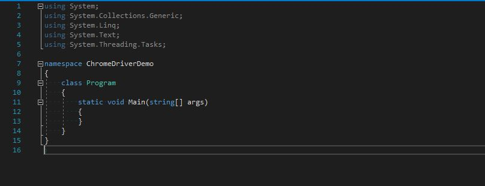
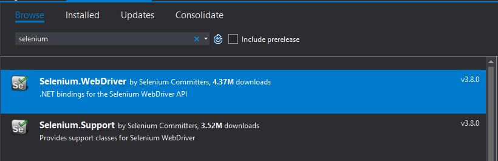
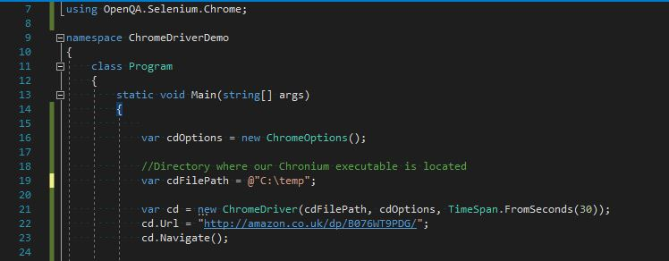
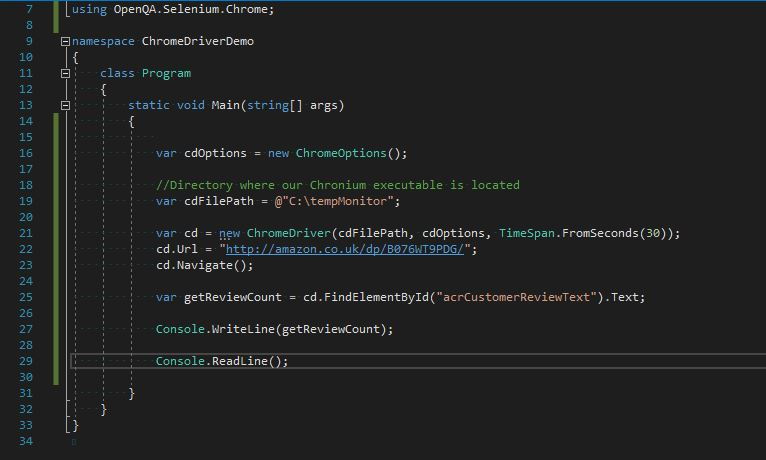
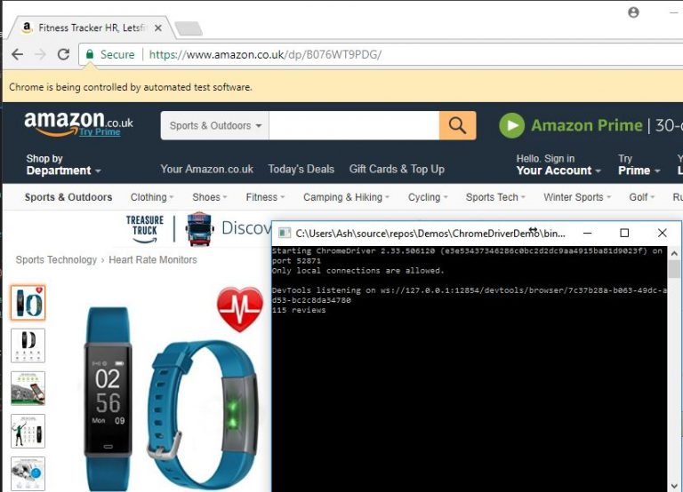

### Selenium

I have used [Selenium](https://github.com/SeleniumHQ/selenium) on occasion for automated frontend tests, it’s my go-to for web automation testing and provides an interface to enable browsers to use the libraries.

[ChromeDriver](https://sites.google.com/a/chromium.org/chromedriver/) is the implementation of the Chrome browser using the [WebDriver protocols](https://github.com/SeleniumHQ/selenium/wiki/JsonWireProtocol) developed by Selenium, you can think of this in three blocks.

 * Chrome – your browser
 * WebDriver and language protocols – the driver
 * Executable by the Chromium project – the middleware that you’ll download

Also it’s worth pointing out that there are implementations for browsers such as Firefox and Edge, handy for cross browser testing!

### But for data scraping?

First, let’s make sure we’re on the same page. By data scraping I mean grabbing information from web pages programmatically ie parsing the HTML markup for that sweet data. Granted thanks to the popularity of RESTful API’s, we don’t need to do this as much, but it’s still required from time to time.

At an abstract viewpoint, you’re making a request for a web page and receiving the markup as a response which can then be parsed, it’s trivial to do in many languages. A basic C# example would be:


using(var wc = new WebClient())
{
    var html = wc.DownloadString("http://somewebsite.com/some-page.html");
}


And use a library such as [HtmlAgilityPack](https://www.nuget.org/packages/HtmlAgilityPack/) for all your parsing and selector needs.

**However** – Many web apps now use JavaScript based frameworks such as Angular, React and Vue to pull information into an application client-side. This uses the browsers JavaScript engine (called V8 in Chrome). Without the JavaScript being executed, we’re just pulling in syntax without content, we’re visiting a house but no one is home.

(It’s worth pointing out that many highly popular websites such as [Amazon](https://amazon.co.uk/) deliberately obfuscate their markup and rely on JavaScript to parse it, preventing their data from being mined.)

### Solving the problem
Here’s where our automated testing tool comes in! As the executable uses Chrome’s libraries, we could use this in theory to render our target website, JavaScript included, and programatically get the data we want.

### Trying this out
For this example I’ll be using the amazon.co.uk website, it should be noted that data scraping is grey area, and is likely against their ToS. However it serves as a good educational example for otherwise unobtainable data.

1. Install Chrome if you don’t have it
2. Download the Chromium exe found here

For this example, I’ll create a simple Console Application

Next we’ll need the Selenium.WebDriver package, we can find via the NuGet solution window

Using the Selenium library, we’re going to load our Chronium executable and tell Chrome to browse to a product page

Using the FindElementById method, we’ll pass in the id of the element which contains the information we would like. Our finished demo looks like this

The result:

### Conclusion

This isn’t a better solution than a code only approach due the the overhead of creating an instance of Chrome and the loading and rendering of page(s), however it definitely has use cases especially when dealing with heavy dynamic web apps.