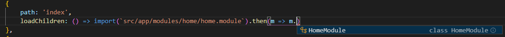

This is a quick post on an error I encountered whilst opting into the [Ivy compiler](https://blog.angular.io/a-plan-for-version-8-0-and-ivy-b3318dfc19f7) (which should be here Nov 2019).

Once you get through the initial errors, you may see the below in your console log:

`
core.js:6014 ERROR Error: Uncaught (in promise): Error: Cannot find module 'src/app/modules/module/your-module.module'
Error: Cannot find module 'src/app/modules/module/your-module.module'
    at $_lazy_route_resource lazy namespace object:5
    at ZoneDelegate.invoke (zone-evergreen.js:365)
    at Object.onInvoke (core.js:39707)
    at ZoneDelegate.invoke (zone-evergreen.js:364)
    at Zone.run (zone-evergreen.js:124)
    at zone-evergreen.js:851
    at ZoneDelegate.invokeTask (zone-evergreen.js:400)
    at Object.onInvokeTask (core.js:39688)
    at ZoneDelegate.invokeTask (zone-evergreen.js:399)
    at Zone.runTask (zone-evergreen.js:168)
    at resolvePromise (zone-evergreen.js:793)
    at resolvePromise (zone-evergreen.js:752)
    at zone-evergreen.js:854
    at ZoneDelegate.invokeTask (zone-evergreen.js:400)
    at Object.onInvokeTask (core.js:39688)
    at ZoneDelegate.invokeTask (zone-evergreen.js:399)
    at Zone.runTask (zone-evergreen.js:168)
    at drainMicroTaskQueue (zone-evergreen.js:570)
    at ZoneTask.invokeTask [as invoke] (zone-evergreen.js:485)
    at invokeTask (zone-evergreen.js:1596)
`

You’re getting this error due to Angular 8 introduced a new recommended module loading method, previously the default method of lazy loading modules was to specify a string path to a module:

`{path: '/admin', loadChildren: './admin/admin.module#AdminModule'}`

This was something built into the Angular toolchain, and performed some wizardry to parse and load the module from the `loadChildren` attribute.

Since Angular 8, the method of importing modules has changed to the industry recognised / standard, [dynamic import](https://developer.mozilla.org/en-US/docs/Web/JavaScript/Reference/Statements/import#Dynamic_Imports). So your import should now be changed to:

`loadChildren: () => import('./admin/admin.module').then(m => m.AdminModule)`

Depending upon your IDE choice, you’ll likely also get Intellisense too:

