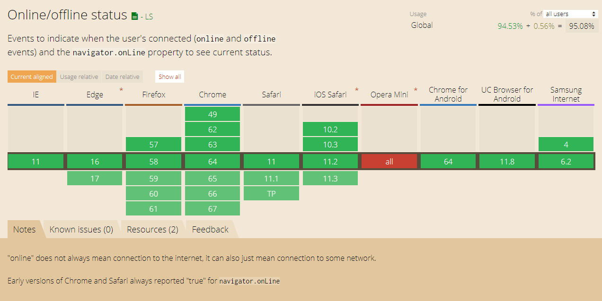
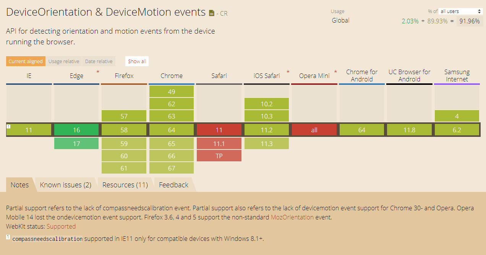
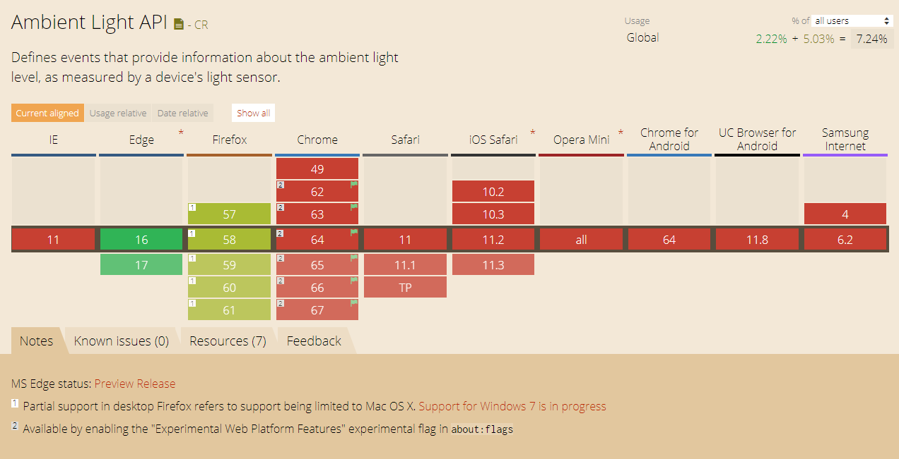
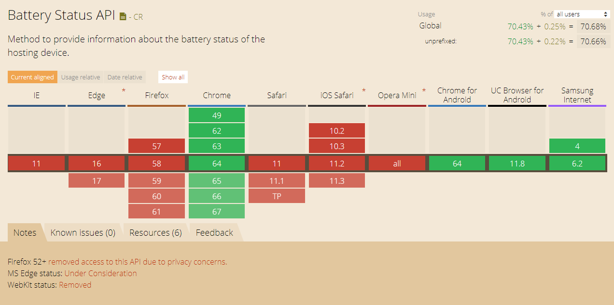

There's a lot of cool things that HTML5 can do, using local storage for data saving/retrieval or acquiring a users geolocation for your custom Google map. Well it turns out there’s many many more JavaScript APIs than I haven’t seen people mention, below are a few of these.

Before we go on, I should mention I’ll be focusing on APIs which benefit mobile/tablet devices, since these are really cool useful in modern web applications.

### Online State

This exposes network connection information to web, quite simply we can now determine if a user has a Internet connection within our web application. This is highly useful in cases where the apps streams data in, we can let the user know that there’s a connection issue rather than simply returning nothing creating a much better user experience.

This API is being updated, things like grabbing a connection speed and adjusting app according would be useful, for example image degradation.


window.addEventListener('offline', networkStatus);
window.addEventListener('online', networkStatus);
function networkStatus(e) {
  console.log(e);
}


#### Support

Browser support for this is excellent for recent browser versions, with some of the smaller device specific browsers such as Samung Internet supporting it.

### Device Orientation

From this we have an easy way to determine the orientation of a device. This would be especially useful when dealing with media heavy web apps and ensuring your content can use the new orientation real estate efficiently. Also combined with CSS we can rotate images in a 3D space.


window.addEventListener('deviceorientation', (e) => {
console.log('alpha:', e.alpha);
console.log('beta:', e.beta); 
console.log('gamma:', e.gamma);
});


#### Support

Browser support for this isn’t great, partial support with knows issues, fine for fun features and non essential but I wouldn’t rely on it.

### Capture Ambient Light

This is really, really cool. The metric returned from this is [lux](https://en.wikipedia.org/wiki/Lux) which is used to measure light. You can read about the sensor API more [here](https://www.w3.org/TR/generic-sensor/). A use case for this would be switching to a darker or lighter theme depending on available light, enabling the user to choose would certainly be a nice feature and provide a better user experience.


window.addEventListener('devicelight', (e) => {
  console.log(`${e.value} lux`);
})


#### Support

Browser support for this is bad, it has been available in Chrome since version 62, however is an experimental feature and has to be enabled.

### Battery Level

We can now detect battery levels, therefore also having the added benefit of determining if a device is plugged into a power source.  The [code for this](https://w3c.github.io/battery/) a little different in that you’re using a promise. Since the W3C example has many code samples, I’ll use one of these.


navigator.getBattery().then(function(battery) {
  console.log(battery.level);
  battery.addEventListener('levelchange', function() {
    console.log(this.level);
  });
});


#### Support

Browser support for this is pretty poor unless you’re specifically targeting Chrome. Also as FireFox have removed the feature, therefore it doesn’t look promising for the future.

