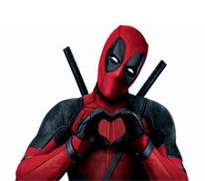
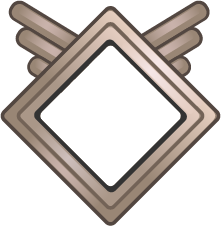

### Overview

In this post, we’ll go over image manipulation via creating a pipeline, the goal of this post will be to create avatar, consisting of a user/character, then surrounding this picture with a frame as an overlay.

### Requirements

Rather than using `System.Drawing` we’ll instead using [ImageSharp](https://github.com/SixLabors/ImageSharp) which is the most popular image processing library written using .NET Core, it’s very fast and highly optimized, despite being in beta I have used in production for a year without problems.

Using this library, we’ll create our own pipeline of image operations to perform using `IImageProcessingContext`, and take advantage of some of heavy lifting ImageSharp provides.

For assets, we’ll be using two images, a base picture and an overlay to surround:

Base picture (me.png)

Overlay (frame.png)

### Project Setup

* Create a .NET Core Console App
* Add the following Package Reference to your .csproj file `<PackageReference Include="SixLabors.ImageSharp.Drawing" Version="1.0.0-beta0007" />` If you install through nuget, ensure that `.Drawing` is included, else you won’t be able to access the `SixLabors.Shapes` namespace
* Add the assets to your project, make sure you select `Copy if newer` in the Properties panel > Copy to Output Directory

### Code

The first part of this process is to alter the shape of our user image to something the resembles a diamond.

Below is the code for this, with heavy use of comments elaborating on the process since this is much easier than blog annotations:

   
    static void Main(string[] args)
    {
        // directory to output results
        System.IO.Directory.CreateDirectory("output");

        // wrap operations in using statements to ensure that Dispose is called
        using (var img = Image.Load("me.png"))
        {
            // clone the original image, since we need this for future runs of the application
            using (Image destRound = img.Clone(x => x.AvatarShaping(new Size(225, 225), 150)))
            {
                destRound.Save("output/result.png");
            }
        }
    }

/// 

    /// Here's we're implementing the IImageProcessingContext interface and extending it via an extension method,
    /// This implements a full image mutating pipeline operating on IImageProcessingContext
    /// 

    /// <param name="processingContext">the processingContext</param>
    /// <param name="size">Size of the image</param>
    /// <param name="cornerRadius">corner radius desired, higher will result in a smaller fill</param>
    /// <returns></returns>
    private static IImageProcessingContext AvatarShaping(this IImageProcessingContext processingContext, Size size, float cornerRadius)
    {
        return processingContext.Resize(new ResizeOptions
        {
            Size = size,
            Mode = ResizeMode.Crop
        }).ApplyRoundedCorners(cornerRadius); // the next part of our pipeline
    }

    // This method can be seen as an inline implementation of an `IImageProcessor`:
    // (The combination of `IImageOperations.Apply()` + this could be replaced with an `IImageProcessor`)
    private static IImageProcessingContext ApplyRoundedCorners(this IImageProcessingContext ctx, float cornerRadius)
    {
        Size size = ctx.GetCurrentSize();
        IPathCollection corners = BuildCorners(size.Width, size.Height, cornerRadius);

        var graphicOptions = new GraphicsOptions(true)
        {
           // AlphaCompositionMode = PixelAlphaCompositionMode.DestOut // enforces that any part of this shape that has color is punched out of the background
        };
        // mutating in here as we already have a cloned original
        // use any color (not Transparent), so the corners will be clipped
        return ctx.Fill(graphicOptions, Rgba32.LimeGreen, corners);
    }

    private static IPathCollection BuildCorners(int imageWidth, int imageHeight, float cornerRadius)
    {
        // first create a square
        var rect = new RectangularPolygon(-0.5f, -0.5f, cornerRadius, cornerRadius);

        // then cut out of the square a circle so we are left with a corner
        // Changing the offsets will change how much of the shape is cut out
        IPath cornerTopLeft = rect.Clip(new EllipsePolygon(cornerRadius - 0.5f, cornerRadius - 0.5f, cornerRadius));

        // corner is now a corner shape positions top left
        //lets make 3 more positioned correctly, we can do that by translating the original around the center of the image

        float rightPos = imageWidth - cornerTopLeft.Bounds.Width + 1;
        float bottomPos = imageHeight - cornerTopLeft.Bounds.Height + 1;

        // move it across the width of the image - the width of the shape
        // cut the remaining 3 corners
        IPath cornerTopRight = cornerTopLeft.RotateDegree(90).Translate(rightPos, 0);
        IPath cornerBottomLeft = cornerTopLeft.RotateDegree(-90).Translate(0, bottomPos);
        IPath cornerBottomRight = cornerTopLeft.RotateDegree(180).Translate(rightPos, bottomPos);

        return new PathCollection(cornerTopLeft, cornerBottomLeft, cornerTopRight, cornerBottomRight);
    }


The above code results in the following image:

We can achieve our approximate diamond shape via increasing the `cornerRadius` float value, however this will result in less of the canvas showing, below is 200:

Side note, if you wanted a circle, all that would be required is to set the `cornerRadius` to 50% of the image size.

Currently we’re filling in the areas we’ve clipped with a solid green. Great for testing, but not for our desired result. You will want to comment out the following line which will automatically remove our colour fill.

`AlphaCompositionMode = PixelAlphaCompositionMode.DestOut`

Next, we’ll add our overlay, this is simpler than the previous code. We’ll embed another `using` statement since we still want the original outputs, this makes viewing each stage of the process and making changes much easier whilst we build the pipeline.

Add the following within the `destRound` using, after `destRound.Save("output/fb.png");`


using (var overlay = Image.Load("frame.png"))
{
    using (Image overlayClone = destRound.Clone(x => x.GenerateOverlay(overlay)))
    {
        overlayClone.Save("output/complete.png", new PngEncoder()
      {
        ColorType = PngColorType.RgbWithAlpha // needed to instruct the encoder transparency is required
      });
    }
}


`GenerateOverlay` is part our pipeline for this project, add the following:


private static IImageProcessingContext GenerateOverlay(this IImageProcessingContext processingContext, Image me)
{
    return processingContext.DrawImage(me, new Point(0, 0), new GraphicsOptions());
}


The above method will draw the image together with the previous image, once that has completed this will be saved to the disk.

### The Final Result

It should be noted that the code above is simply a proof in concept, for instance the `Clone` methods add overhead and shouldn’t appear in production code.