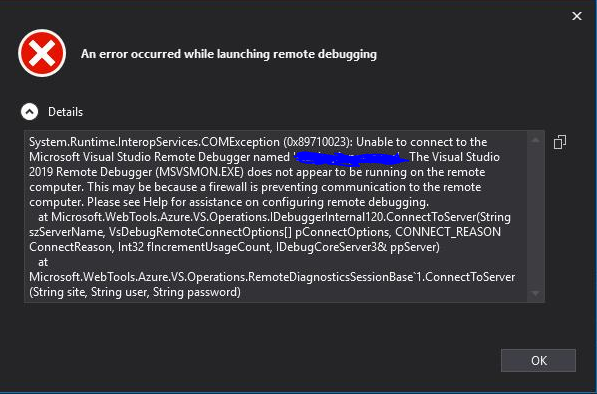

### An Error Occurred while launching remote debugging

This is a relatively common problem (in my experience).

<escape><!-- more --></escape>
Generally, ensuring that port 4022 for Visual Studio 2019 or 4020 if you're using 2017 isn't block by your network resolves the issue.

However in my case, this didn't work.

#### Solution

The Web App in question had a custom domain, on the DNS side it was a CNAME since being a sub-domain

Finding the IP address of the app (via Properties in Azure) and making two entries in host file on windows for the CNAME and original *.azurewebsites.net sub domain fixed the issue.