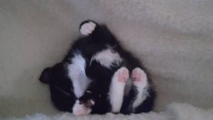
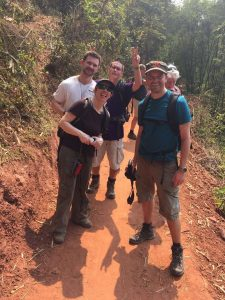
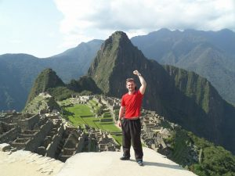
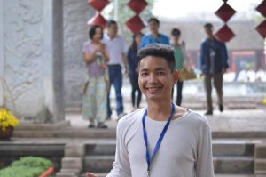
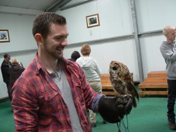

I started this blog to help spread information about ideas, methods and practices in the software development field and serve as a resource for myself. I don’t have a post schedule and the topics vary rather than adhering to a strict language, process or methodology.

# Things about me

  * I accidentally swallowed a 2p coin when I was 13 (please don’t ask me how)
  * I have ~~one~~ two cats with my ~~fiancée~~ wife

  * I'm into travelling and intend to do more

  * My favourite animal are Owls

# Education

#### 2004

I started studying ICT at Burnley College where my appetite for computers grew, whilst studying full time courses I also studied night courses to accelerate things until 2008.

#### 2005

I receive an letter from OFSTED stating my module results were within the top 10 in the country. I also win the Student Excellency 2005 award.

#### 2006

I enter an optional web design competition as part of my web design module, I won gold and came first in my county.

#### 2006

I travel to Milton Keynes and compete against other county winners, I win the competition and gain gold in [UK Skills Challenge 2006](http://www.lancashiretelegraph.co.uk/news/1062509.Web_design_nets_trip_to_land_of_rising_sun/?ref=arc) and win a place to compete against other countries. I’m lucky enough to also win the Student Excellency 2006 award.

#### 2007

I gain a part time job doing hardware and software development in a local company, I gain a training manager and spend time in Coventry with other candidates in different sectors training for the events. I decide not to go Japan.

#### 2007

I start helping with college classes as an assistant, teaching new students with Photoshop and Dreamweaver.

#### 2008

I start a full time course at Bolton University – BSc Business Software Development.

#### 2009

I enroll with Unite with Business, this involved meeting with local businesses and designing/implementation various websites, I partners with 4 companies until I finish my studies creating information websites and e-commerce solutions.

#### 2011

I graduate with distinction and receive a phone call congratulating on the highest mark gained. I receive an offer for a research role but decline to pursue a Masters degree.

#### 2011

I move to Sheffield and start a [MSc(Eng) Advanced Software Engineering](https://www.sheffield.ac.uk/postgraduate/taught/courses/engineering/compscience/advanced-software-engineering-msc) degree at [The University of Sheffield](https://www.sheffield.ac.uk/).

#### 2012

I graduate from The University of Sheffield and I’m fortunate enough to pass with Distinction.

#### 2012

I move back to Burnley, I start at Basis Media as a Web Application Developer.

#### 2016

Won the Innovation category at [RAD](http://www.radawards.com/) awards for the GAME careers site.

#### 2018

Started a postion at Seriun as Lead Developer

